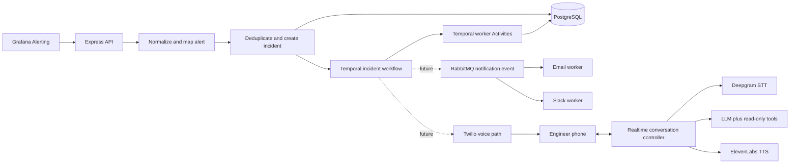
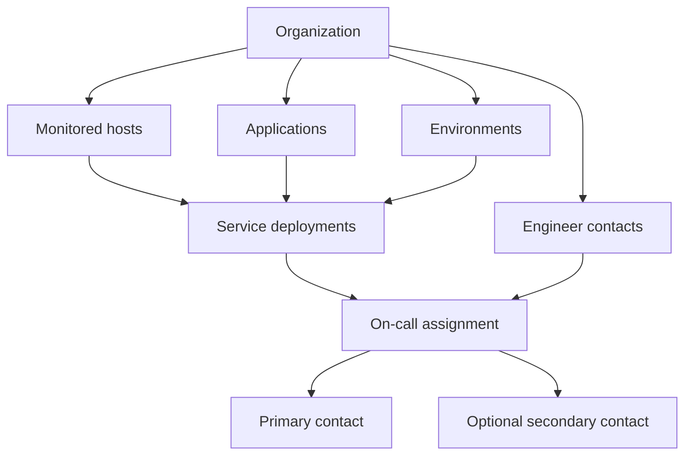

# WakeOps architecture

## Main flow

The solid path through Temporal and PostgreSQL is implemented. The dotted Twilio and RabbitMQ paths
are future phases.

## Organization ownership

One host can have many service deployments. For example, EC2 instance `i-111` can run both
`payment-service` and `auth-service` in production. Each service deployment has one contact
assignment. WakeOps will not guess a service when an alert only identifies a shared host. That alert
remains unmapped unless an explicit host-only routing policy is added later.

Database relations include the organization ID so another organization's records cannot be linked
accidentally. Creating a service deployment and its assignment uses one transaction. This means both
changes succeed together, or neither is saved. Monitoring connection identities are isolated per
organization. Scheduling will be added later.

## Alert identity

The incident fingerprint identifies one ongoing problem. It uses the organization, alert name,
host, service, environment and other stable identity labels. Changing a metric value or severity
does not create another active incident.

The alert event key identifies one exact delivery. It also includes status, occurrence time, value,
severity, labels and annotations. An identical webhook retry is ignored, while changed information
is stored as another event on the same incident.

## Module responsibilities

- `database`: the one PostgreSQL schema and client. It stores durable product facts.
- `integrations`: Grafana webhook parsing plus future GitHub and Slack connection code. It prevents
  external provider formats from leaking into incident business rules.
- `alerts`: defines the provider-neutral alert type and calculates stable incident fingerprints and
  exact delivery keys.
- `incidents`: maps resources, deduplicates deliveries, creates or resolves incidents, and records
  the durable audit timeline.
- `workflows`: deterministic Temporal workflow decisions, signals, queries, state transitions, and
  Activity contracts. Workflow code decides what should happen without directly calling databases
  or providers.
- `telephony`: starts Twilio calls and idempotently handles status callbacks.
- `voice`: moves mu-law audio between Twilio, Deepgram, and ElevenLabs and owns listening, speaking
  and interruption state.
- `agent`: gives the model compact incident context and a strict allowlist of read-only tools plus
  acknowledgement and note actions.
- `notifications`: publishes one notification event and lets email and Slack consumers deliver it
  independently.
- `observability`: structured logs, OpenTelemetry traces, Prometheus metrics, Langfuse AI traces,
  and configurable cost estimates.
- `shared`: only truly provider-neutral small types and helpers. It must not become a dumping ground.

## Call memory boundary

Each active call will have short-term session context: the incident facts, transcript so far, tools
already called, tool results, current turn state, and acknowledgement status. Durable facts such as
acknowledgement and transcript metadata belong in PostgreSQL. Fast in-process state can help operate
the live stream, but must not be the only copy of an important business fact.

We are intentionally not adding cross-incident, long-term AI memory. The agent will not infer habits
such as "this engineer usually handles payments" or retrieve old incidents as personal memory. That
avoids stale conclusions, privacy risk, and an unnecessary retrieval system.

## Why API and workers are separate processes

The API must answer webhooks and callbacks quickly and host voice WebSockets. Temporal workers and
RabbitMQ consumers spend their time polling and performing background work. Separating their
processes prevents a busy notification queue from slowing HTTP requests, while all code still lives
in one understandable monorepo.

## Temporal incident flow

The API uses `incident-{incidentId}` as the workflow ID. Starting the same incident again returns the
existing workflow instead of creating another one. This protects us when Grafana retries a webhook.

The workflow receives only the incident ID. A worker Activity loads the current PostgreSQL state and
moves an open incident to `NOTIFYING`. The workflow then waits without consuming a busy thread.
Acknowledgement changes the incident to `ACKNOWLEDGED`, but the workflow continues waiting because
acknowledged and resolved mean different things. A resolution signal changes the incident to
`RESOLVED` and completes the workflow.

Temporal retries a failed Activity for temporary technical problems. Future no-answer retries are
business decisions implemented explicitly with workflow timers. These are separate mechanisms.

## ChatGPT plan connection boundary

WakeOps will only use the official Sign in with ChatGPT authorization path when the project is
eligible. OAuth tokens stay on the server and are encrypted at rest. Model discovery is a catalog;
the app must handle the selected model being unavailable to a particular request. The provider
interface will also allow an OpenAI API key or another LLM provider later. No hosted server will run
`codex login --device-auth` or copy Codex CLI credentials.
