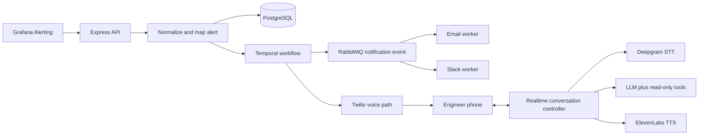
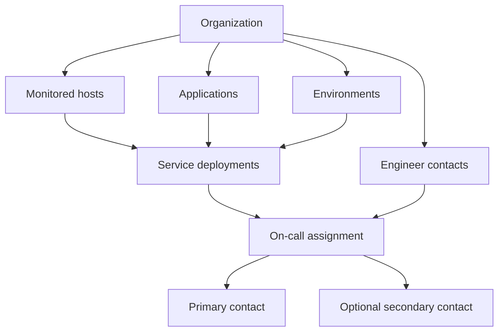

# WakeOps architecture

## Main flow

Dashed/future components are described here but are not implemented in milestone 1.

## Organization ownership

One host can have many service deployments. For example, EC2 instance `i-111` can run both
`payment-service` and `auth-service` in production. Each service deployment has one contact
assignment. WakeOps will not guess a service when an alert only identifies a shared host. That alert
will remain unmapped until we introduce an explicit host-only routing policy.

Database relations include the organization ID so another organization's records cannot be linked
accidentally. Creating a service deployment and its assignment uses one transaction. This means both
changes succeed together, or neither is saved. Scheduling and monitoring connection identities will
be added later.

## Module responsibilities

- `database`: the one PostgreSQL schema and client. It stores durable product facts.
- `integrations`: Grafana webhook parsing plus future GitHub and Slack connection code. It prevents
  external provider formats from leaking into incident business rules.
- `alerts`: turns provider payloads into one alert type, maps resources, and calculates a stable
  fingerprint so duplicate webhooks do not create duplicate incidents.
- `incidents`: creates incidents and records status/timeline changes.
- `workflows`: Temporal workflow decisions and the Activities that perform outside work. Workflow
  code decides what should happen; Activities call databases and providers.
- `telephony`: starts Twilio calls and idempotently handles status callbacks.
- `voice`: moves μ-law audio between Twilio, Deepgram, and ElevenLabs and owns listening/speaking/
  interruption state.
- `agent`: gives the model compact incident context and a strict allowlist of read-only tools plus
  acknowledgement/note actions.
- `notifications`: publishes one notification event and lets email and Slack consumers deliver it
  independently.
- `observability`: structured logs, OpenTelemetry traces, Prometheus metrics, Langfuse AI traces,
  and configurable cost estimates.
- `shared`: only truly provider-neutral small types and helpers. It must not become a dumping ground.

## Call memory boundary

Each active call will have short-term session context: the incident facts, transcript so far, tools
already called, tool results, current turn state, and acknowledgement status. Durable facts such as
acknowledgement and transcript metadata belong in PostgreSQL. Fast in-process state can help operate
the live stream, but must not be the only copy of an important business fact.

We are intentionally not adding cross-incident, long-term AI memory. The agent will not infer habits
such as “this engineer usually handles payments” or retrieve old incidents as personal memory. That
avoids stale conclusions, privacy risk, and an unnecessary retrieval system.

## Why API and workers are separate processes

The API must answer webhooks and callbacks quickly and host voice WebSockets. Temporal workers and
RabbitMQ consumers spend their time polling and performing background work. Separating their
processes prevents a busy notification queue from slowing HTTP requests, while all code still lives
in one understandable monorepo.

## ChatGPT plan connection boundary

WakeOps will only use the official Sign in with ChatGPT authorization path when the project is
eligible. OAuth tokens stay on the server and are encrypted at rest. Model discovery is a catalog;
the app must handle the selected model being unavailable to a particular request. The provider
interface will also allow an OpenAI API key or another LLM provider later. No hosted server will run
`codex login --device-auth` or copy Codex CLI credentials.
